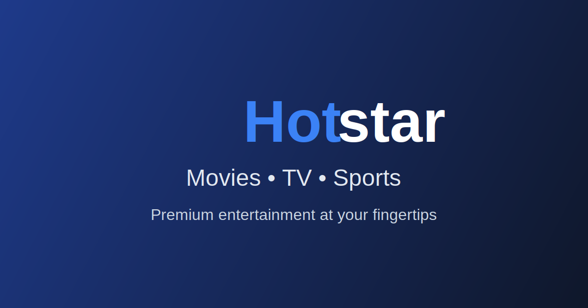

# Hotstar Clone - Premium Streaming Platform



A visually appealing and responsive Hotstar clone built with React, TypeScript, Tailwind CSS, and Framer Motion. This project replicates the UI/UX of the popular streaming platform with a modern design approach, dark mode support, and smooth animations.

## 💻 [Live Demo](#)

_Note: Replace with your actual deployed application URL once available_

## ✨ Features

- **Responsive Design**: Fully responsive layout that works seamlessly across mobile, tablet, and desktop devices
- **Dynamic Hero Banner**: Eye-catching hero section with animated elements and parallax effects
- **Movie/Show Cards**: Interactive cards with hover animations and lazy loading
- **Dark Mode**: Toggle between light and dark themes with smooth transitions
- **Search Modal**: Elegant search functionality with real-time results
- **Sticky Navbar**: Navigation bar that transforms on scroll with shadow effects
- **Accessibility**: ARIA attributes and keyboard navigation for better accessibility
- **Performance Optimized**: Lazy loading and image optimizations for faster loading
- **Animation Effects**: Smooth entrance animations using Framer Motion
- **Modern UI**: Clean and modern UI inspired by premium streaming platforms

## 🛠️ Tech Stack

- **React 19**: Frontend library for building user interfaces
- **TypeScript**: Static type checking for robust code
- **Tailwind CSS**: Utility-first CSS framework for styling
- **Framer Motion**: Animation library for React
- **Context API**: For state management (dark mode implementation)
- **React Hooks**: For functional component state and effects

## 📱 Screenshots

### Home Page with Hero Banner


### Dark Mode


### Search Modal


### Responsive Mobile View


## 🚀 Installation & Setup

1. **Clone the repository**

   ```bash
   git clone https://github.com/yourusername/hotstar-clone.git
   cd hotstar-clone
   ```

2. **Install dependencies**

   ```bash
   npm install
   ```

3. **Run the development server**

   ```bash
   npm start
   ```

4. **Build for production**
   ```bash
   npm run build
   ```

## 🧩 Project Structure

```
src/
├── components/      # Reusable UI components
│   ├── DarkModeToggle.tsx
│   ├── Footer.tsx
│   ├── Hero.tsx
│   ├── Navbar.tsx
│   ├── SearchModal.tsx
│   └── TrendingNow.tsx
├── contexts/        # React Context providers
│   └── ThemeContext.tsx
├── App.tsx          # Main App component
└── index.tsx        # Entry point
```

## ✅ Key Implementation Details

1. **Responsive Design**

   - Used Tailwind's responsive classes for different screen sizes
   - Mobile-first approach with progressive enhancement

2. **Dark Mode**

   - Context API for global state management
   - CSS transitions for smooth theme switching
   - Persistent preference using localStorage

3. **Animations**

   - Framer Motion for entrance animations and micro-interactions
   - Smooth hover effects for interactive elements

4. **Performance**

   - Lazy loading for off-screen images
   - Optimized render performance with React hooks
   - Prioritized loading for above-the-fold content

5. **Accessibility**
   - Semantic HTML structure
   - ARIA attributes for interactive elements
   - Keyboard navigation support
   - Screen reader friendly content

## 🔜 Future Enhancements

- User authentication system
- Backend integration for real data
- Video playback functionality
- Personalized recommendations
- Watchlist and favorites
- Progressive Web App (PWA) capabilities

## 👥 Contributing

Contributions are welcome! Please feel free to submit a Pull Request.

1. Fork the repository
2. Create your feature branch (`git checkout -b feature/amazing-feature`)
3. Commit your changes (`git commit -m 'Add some amazing feature'`)
4. Push to the branch (`git push origin feature/amazing-feature`)
5. Open a Pull Request

## 📄 License

This project is licensed under the MIT License - see the LICENSE file for details.

## 🙏 Acknowledgements

- Design inspiration from [Hotstar](https://www.hotstar.com)
- [Tailwind CSS](https://tailwindcss.com/)
- [Framer Motion](https://www.framer.com/motion/)
- [React Icons](https://react-icons.github.io/react-icons/)
- [Unsplash](https://unsplash.com/) for placeholder images

---

**Note**: This is a demo project created for educational purposes and is not affiliated with or endorsed by Hotstar.
